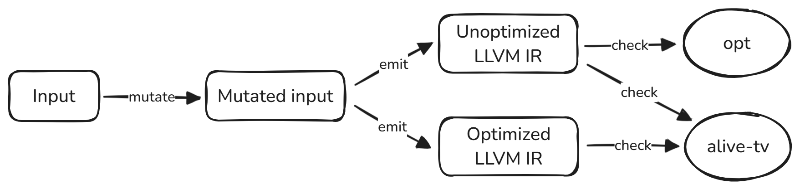

## Poor Man's Fuzz Testing

Heavily inspired by [High-Throughput, Formal-Methods-Assisted Fuzzing for LLVM][1],
this is what we will do:

1. Mutate input IR using [Radamsa][2], even though Radamsa is not the best
   tool for this job.
2. Make sure that, once we have SSA form, the resulting LLVM IR is valid. If
   we emit invalid LLVM IR, we have found a bug in our compiler.
3. Validate optimizing transformations using [Alive2][3], like we already do
   in [llvm/test/expect.sh](../llvm/test/expect.sh). If Alive2 complains about
   some transformation, we have found a bug in our compiler.

Here is a graphical overview of our fuzzing approach:


The process is not fully automated at this point, so let's walk through an
example. We use [mutate.sh](mutate.sh) to generate *n* variants of an input
program, say [examples/fib.hir](examples/fib.hir). Let's choose *n* = 3 for
brevity of output:


```console
$ ./mutate.sh examples/fib.hir 1-3

+--------------------+
| corpus/fib_001.hir |
+--------------------+
diff --git examples/fib.hir corpus/fib_001.hir
index b8d74d0..25fd259 100644
--- examples/fib.hir
+++ corpus/fib_001.hir
@@ -1,8 +1,8 @@
 int fib(int)
 
 fib(n) {
-    t0 := 0
-    t1 := 1
+    t256 := 0
+    t1 := -12
     if n < 2 {
         return n
     }
@@ -13,5 +13,5 @@ fib(n) {
         t1 := t2
         i := i + 1
     }
-    return t1
+    return t255
 }

+--------------------+
| corpus/fib_002.hir |
+--------------------+
diff --git examples/fib.hir corpus/fib_002.hir
index b8d74d0..3baa03b 100644
--- examples/fib.hir
+++ corpus/fib_002.hir
@@ -8,7 +8,7 @@ fib(n) {
     }
     i := 2
     while i <= n {
-        t2 := t0 + t1
+        t32770 := t0 + t1
         t0 := t1
         t1 := t2
         i := i + 1

+--------------------+
| corpus/fib_003.hir |
+--------------------+
diff --git examples/fib.hir corpus/fib_003.hir
index b8d74d0..610ad59 100644
--- examples/fib.hir
+++ corpus/fib_003.hir
@@ -9,7 +9,6 @@ fib(n) {
     i := 2
     while i <= n {
         t2 := t0 + t1
-        t0 := t1
         t1 := t2
         i := i + 1
     }
```

The generated test cases, numbered 001 through 003, are collected in a
subdirectory to keep things tidy. Then, we fuzz:

```console
$ ./fuzz.sh examples/fib.hir
```

No output, no failures. Feel free to inspect *fib.fuzz.out* for details.

Okay, let's start getting serious:

```console
$ for x in examples/*.hir; do ./mutate.sh $x 1-10; done > /dev/null
$ for x in examples/*.hir; do ./fuzz.sh $x; done
[FAIL] corpus/pow_009.hir
[FAIL] corpus/sort_001.hir
[FAIL] corpus/sort_002.hir
[FAIL] corpus/test01_010.hir
```

Oh well, here we go. Time to fix some bugs...

<!-- References -->

[1]: https://blog.regehr.org/archives/2148
[2]: https://gitlab.com/akihe/radamsa
[3]: https://github.com/AliveToolkit/alive2
